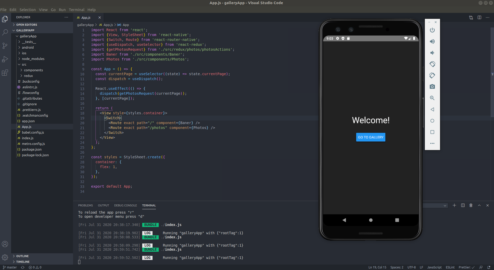
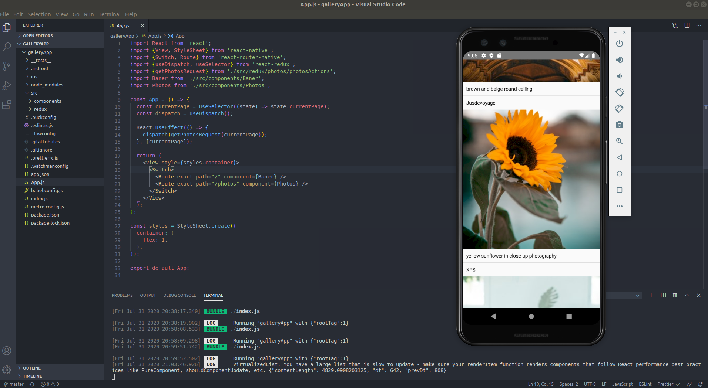
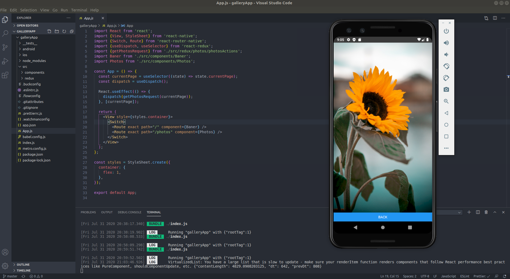

## Gallery app

Mobile application.

## Description

The project is designed to demonstrate knowledge and practical skills in the framework for developing mobile applications React Native, data fetching with native JavaScript lib Fetch API, managing application state with Redux.

### Demo

#### Screenshots of the app

 

  

### Technologies

#### Front-end

- React Native
- Redux && Redux Thunk
- React Router Native
- Fetch API

#### Backend

- Unsplash Image API 

### Features 

- Browsing images from Unsplash Image API 
- Loading new images by scrolling the page

## Getting started

#### Setting up the development environment

https://reactnative.dev/docs/environment-setup

#### Start with installing the dependencies:

  Run `npm install` to install all required packages.

#### Running:

  - Use `npm start` &&  `react-native run-android` to start the dev server (Android)
  - Use `npm start` &&  `npx react-native run-ios` to start the dev server (iOS)
  
 
